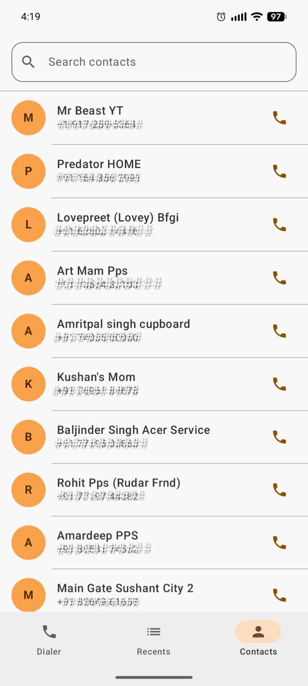
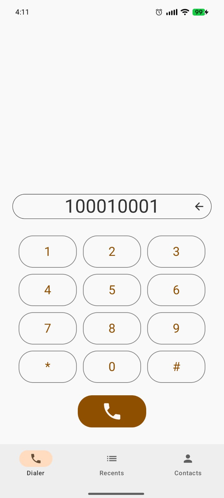
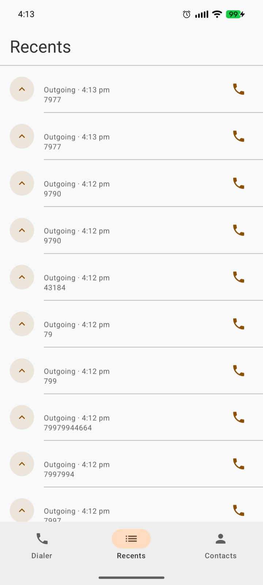

# 📞 RealCallingApp

A modern, fully-featured Android phone dialer application built with **Kotlin** and **Jetpack Compose**, following clean architecture principles (MVVM + Repository Pattern).

---

## 📋 Table of Contents

- [About](#about)
- [Screenshots](#screenshots)
- [Features](#features)
- [Architecture](#architecture)
- [Technology Stack](#technology-stack)
- [Performance Optimizations](#performance-optimizations)
- [Project Structure](#project-structure)
- [Getting Started](#getting-started)
- [Build Configuration](#build-configuration)
- [Permissions](#permissions)
- [Dependencies](#dependencies)

---

## About

**RealCallingApp** is a native Android calling application that provides a clean, modern interface for managing phone calls. It integrates directly with the Android system's call logs and contacts, offering a seamless replacement or companion to the stock dialer app.

- **Package:** `com.oceanentp.realcalling`
- **Minimum SDK:** 33 (Android 13)
- **Target SDK:** 36 (Android 15)
- **Language:** Kotlin
- **UI:** 100% Jetpack Compose

---

## Screenshots

<table>
  <tr>
    <td align="center">
      <strong>Contacts Screen</strong><br/>
      
    </td>
    <td align="center">
      <strong>Dialer Screen</strong><br/>
      
    </td>
    <td align="center">
      <strong>Call Logs Screen</strong><br/>
      
    </td>
  </tr>
</table>

---

## Features

### 📱 Dialer Screen
- **Numeric Keypad** — Standard 4×3 phone keypad layout (digits 1–9, *, 0, #)
- **Live Number Display** — Real-time display of the typed phone number
- **Backspace** — Delete the last entered digit with a single tap
- **Smart Call Button** — Call button is enabled only when a valid number has been entered
- **Input Filtering** — Accepts only valid phone number characters (digits, `+`, `*`, `#`)

### 📋 Recents / Call Logs Screen
- **Full Call History** — Displays all recent calls in reverse-chronological order
- **Call Type Indicators** — Visual icons for incoming (⬇️), outgoing (⬆️), and missed (📞) calls with distinct color coding
- **Contact Name Resolution** — Shows saved contact name when available, falls back to phone number
- **Smart Timestamp Formatting:**
  - Time only (e.g., `2:30 PM`) for calls made today
  - Day name (e.g., `Mon`) for calls made within the current week
  - Full date (e.g., `Mar 15`) for older calls
- **Call Duration** — Displays duration in minutes and seconds for each call
- **Quick Redial** — Tap any call log entry to immediately call that number back
- **Empty State UI** — Informative placeholder when no call history exists

### 👤 Contacts Screen
- **Device Contacts List** — Displays all contacts stored on the device that have phone numbers
- **Real-time Search** — Instantly filter contacts by name or phone number as you type
- **Contact Avatars** — Auto-generated avatar showing the contact's first initial
- **One-Tap Calling** — Tap any contact to initiate a call instantly
- **Empty State UI** — Handles the scenario gracefully when no contacts are found

### 🔀 Navigation
- **Bottom Navigation Bar** — Three-tab bottom navigation for quick screen switching:
  - 📱 Dialer (default landing screen)
  - 📋 Recents
  - 👤 Contacts
- **State Preservation** — Active tab persists across configuration changes (rotation, etc.)

### 🔐 Permission Handling
- **Runtime Permission Requests** — Requests all required permissions at app launch
- **Permission Rationale UI** — Displays rationale dialog when required by the system
- **Re-evaluation on Resume** — Re-checks permissions when the app returns to the foreground (handles grants via system settings)
- **Graceful Degradation** — Each screen handles permission denial gracefully with no crashes
- **Observable Permission State** — Permission status is reactive, triggering UI updates automatically

---

## Architecture

RealCallingApp follows **MVVM (Model-View-ViewModel)** clean architecture with a **Repository Pattern** for data access.

```
┌─────────────────────────────────────────────────────┐
│                    UI Layer                         │
│   (Jetpack Compose Screens + Navigation)            │
└──────────────────────┬──────────────────────────────┘
                       │ observes state
┌──────────────────────▼──────────────────────────────┐
│                 ViewModel Layer                     │
│   (ContactsViewModel, CallLogsViewModel)            │
│   StateFlow / MutableStateFlow                      │
└──────────────────────┬──────────────────────────────┘
                       │ requests data
┌──────────────────────▼──────────────────────────────┐
│               Repository Layer                      │
│   (ContactsRepository, CallLogRepository)           │
│   Android ContentResolver queries                   │
└──────────────────────┬──────────────────────────────┘
                       │ accesses
┌──────────────────────▼──────────────────────────────┐
│             Android System Data                     │
│   (Contacts Provider, Call Log Provider)            │
└─────────────────────────────────────────────────────┘
```

### Key Architectural Decisions
- **StateFlow** is used for all UI state — ensuring lifecycle-aware, one-directional data flow
- **AndroidViewModel** provides lifecycle-safe state management
- **ContentResolver** is used directly for efficient access to system databases (no local DB required)
- **Flow** streams are used in repositories, enabling reactive pipelines from data layer to UI

---

## Technology Stack

| Category | Technology | Version |
|---|---|---|
| **Language** | Kotlin | 2.2.10 |
| **UI Framework** | Jetpack Compose | BOM 2024.09.00 |
| **Design System** | Material Design 3 | BOM 2024.09.00 |
| **Architecture** | MVVM + Repository Pattern | — |
| **State Management** | StateFlow / MutableStateFlow | — |
| **Lifecycle** | AndroidX Lifecycle + ViewModel | 2.10.0 |
| **Activity Integration** | Activity Compose | 1.13.0 |
| **Core Extensions** | AndroidX Core KTX | 1.18.0 |
| **Build System** | Gradle with Kotlin DSL | — |
| **Android Gradle Plugin** | AGP | 9.1.0 |
| **Unit Testing** | JUnit | 4.13.2 |
| **UI Testing** | Espresso + Compose Test | 3.7.0 |
| **Min SDK** | Android 13 | API 33 |
| **Target SDK** | Android 15 | API 36 |

---

## Performance Optimizations

### UI Rendering
- **`LazyColumn` for Lists** — Both the Call Logs and Contacts screens use `LazyColumn`, which only renders items currently visible on screen. This ensures smooth performance even with thousands of contacts or call log entries.

### State Management
- **`SharingStarted.WhileSubscribed(5_000)`** — ViewModels expose state using this strategy, which automatically releases upstream resources (cancels ContentResolver queries) 5 seconds after the last observer disappears. This prevents unnecessary background work and conserves memory.

### Data Access
- **Projection-Based ContentResolver Queries** — Repositories query only the specific columns needed (not `SELECT *`), reducing cursor size and memory allocation.
- **Cursor `.use { }` Pattern** — Ensures all ContentResolver cursors are properly closed after use, preventing memory leaks and resource exhaustion.

### Search & Filtering
- **`combine()` for Reactive Search** — In `ContactsViewModel`, search queries are combined with the contacts list using Kotlin Flow's `combine()` operator. This means filtering only runs when either the query or the contact list changes — no redundant re-computations.
- **In-Memory Filtering** — Contacts are loaded once and filtered in memory, avoiding repeated database queries on each keystroke.

### Build Optimizations
- **R8 Code Shrinking** — Release builds have `isMinifyEnabled = true`, enabling R8 (ProGuard successor) to shrink, obfuscate, and optimize the bytecode. This reduces APK size and improves runtime performance.
- **ProGuard Optimization Rules** — Uses `proguard-android-optimize.txt` for aggressive bytecode-level optimizations.
- **Gradle JVM Heap** — Configured with `-Xmx2048m` (2 GB) for the Gradle daemon, speeding up builds on large projects.
- **Kotlin DSL Build Scripts** — Type-safe `build.gradle.kts` files provide compile-time checking for build configuration, reducing build errors.

### Architecture-Level
- **Lifecycle-Aware Components** — ViewModels automatically pause data collection when the associated screen is not active, preventing wasted CPU cycles in the background.
- **`rememberSaveable` for Navigation State** — The active bottom-navigation tab is stored with `rememberSaveable`, surviving configuration changes without triggering full recomposition.
- **Single Recomposition Surface** — Compose's smart recomposition only re-renders composables whose state has changed, not the entire UI tree.

---

## Project Structure

```
app/
└── src/
    └── main/
        ├── java/com/oceanentp/realcalling/
        │   ├── MainActivity.kt                    # App entry point, permission flow
        │   ├── data/
        │   │   ├── model/                         # Data models (Contact, CallLog)
        │   │   └── repository/
        │   │       ├── ContactsRepository.kt      # Contacts ContentResolver queries
        │   │       └── CallLogRepository.kt       # Call log ContentResolver queries
        │   ├── presentation/
        │   │   ├── screens/
        │   │   │   ├── MainScreen.kt              # Root screen with bottom navigation
        │   │   │   ├── DialerScreen.kt            # Numeric keypad UI
        │   │   │   ├── CallLogsScreen.kt          # Recent calls list UI
        │   │   │   └── ContactsScreen.kt          # Contacts list with search UI
        │   │   └── viewmodel/
        │   │       ├── ContactsViewModel.kt       # Contacts state + search logic
        │   │       └── CallLogsViewModel.kt       # Call logs state management
        │   ├── ui/theme/                          # Material3 theme, colors, typography
        │   └── util/
        │       └── PermissionChecker.kt           # Runtime permission management
        ├── res/
        │   ├── values/
        │   │   ├── strings.xml
        │   │   ├── colors.xml
        │   │   └── themes.xml
        │   ├── drawable/
        │   └── mipmap-*/                          # App launcher icons
        └── AndroidManifest.xml
```

---

## Getting Started

### Prerequisites
- **Android Studio** Ladybug (2024.2.1) or newer
- **JDK 11** or higher
- **Android device or emulator** running Android 13 (API 33) or higher

### Clone the Repository
```bash
git clone https://github.com/Sagar19176/RealCallingApp.git
cd RealCallingApp
```

### Build & Run
1. Open the project in **Android Studio**
2. Wait for Gradle sync to complete
3. Select a device/emulator running **Android 13+**
4. Click **Run ▶** or use `Shift + F10`

### Build from Command Line
```bash
# Debug build
./gradlew assembleDebug

# Release build (requires signing config)
./gradlew assembleRelease

# Run unit tests
./gradlew test

# Run instrumentation tests
./gradlew connectedAndroidTest
```

---

## Build Configuration

| Parameter | Value |
|---|---|
| `applicationId` | `com.oceanentp.realcalling` |
| `compileSdk` | 36 (Android 15) |
| `minSdk` | 33 (Android 13) |
| `targetSdk` | 36 (Android 15) |
| `versionCode` | 1 |
| `versionName` | `1.0` |
| `javaVersion` | Java 11 |
| Release minification | Enabled (R8) |

---

## Permissions

The app requires the following Android runtime permissions:

| Permission | Purpose |
|---|---|
| `CALL_PHONE` | Place phone calls from the dialer |
| `READ_CALL_LOG` | Access and display recent call history |
| `READ_CONTACTS` | Access and display device contacts |
| `READ_PHONE_STATE` | Monitor active call state |

All permissions are requested at runtime and the app handles denial gracefully — screens show appropriate empty states instead of crashing.

---

## Dependencies

```toml
# gradle/libs.versions.toml

[versions]
agp                       = "9.1.0"
kotlin                    = "2.2.10"
coreKtx                   = "1.18.0"
lifecycleRuntimeKtx       = "2.10.0"
lifecycleViewmodelCompose  = "2.10.0"
activityCompose           = "1.13.0"
composeBom                = "2024.09.00"
junit                     = "4.13.2"
junitVersion              = "1.3.0"
espressoCore              = "3.7.0"

[libraries]
androidx-core-ktx                    = "androidx.core:core-ktx:1.18.0"
androidx-lifecycle-runtime-ktx       = "androidx.lifecycle:lifecycle-runtime-ktx:2.10.0"
androidx-lifecycle-viewmodel-compose = "androidx.lifecycle:lifecycle-viewmodel-compose:2.10.0"
androidx-activity-compose            = "androidx.activity:activity-compose:1.13.0"
androidx-compose-bom                 = "androidx.compose:compose-bom:2024.09.00"
androidx-compose-ui                  = "androidx.compose.ui:ui"
androidx-compose-ui-graphics         = "androidx.compose.ui:ui-graphics"
androidx-compose-ui-tooling-preview  = "androidx.compose.ui:ui-tooling-preview"
androidx-compose-material3           = "androidx.compose.material3:material3"
junit                                = "junit:junit:4.13.2"
androidx-junit                       = "androidx.test.ext:junit:1.3.0"
androidx-espresso-core               = "androidx.test.espresso:espresso-core:3.7.0"
androidx-compose-ui-test-junit4      = "androidx.compose.ui:ui-test-junit4"
androidx-compose-ui-tooling          = "androidx.compose.ui:ui-tooling"
androidx-compose-ui-test-manifest    = "androidx.compose.ui:ui-test-manifest"
```

---

## License

This project is open source. Feel free to explore, fork, and contribute.
